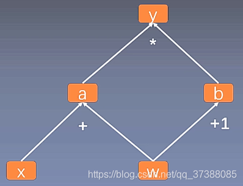

### DQN ###

- state太多，不用表维护Q值，而是用网络来拟合Q值

- experience replay （因为是off-policy，打乱experience相关性，神经网络收敛更有效）

- fixed Q-targets（也是神经网络引起的后续影响，为了网络更新效果更好）

  > 莫烦的解释：这里要了解 qlearning 和 function approximator 的一些细节了。用一个神经网络当 q learning 的 function approximator，会使得对动作价值的评估存在偏差被放大的状况，因为这个function approximator 不是稳定的。为了稳定 target function approximator, 所以就采用了一个变化不快的网络。这样对于学习稳定性的提升十分有帮
  
- DQN与Q learning一个很大的不同是，他的初始化q值是乱的

- 训练收敛情况太吃超参数的设置了

- 遗留：double DQN、Prioritized Experience Replay、dueling DQN可以来解决over estimation和收敛过慢的问题

### readme ###

- main.py文件是我写的，包括训练和运行，部分莫烦源代码的功能没写
- temp.py是按照莫烦的tf1程序改成tf2的
- tf1和tf2的test.py是例程
- memory的格式，除了统一的array形式，分开存应该也挺好实现

### 静态图和动态图 ###

- 计算图，例如

  

- tensorflow 1.0使用静态图（先定义网络再给输入），2.0使用动态图（先赋值，运行中推断图结构）
- 静态图运行效率高，动态图可以像调程序一样debug，tensorflow不同版本也有混合用法，提高效率
- tensor数学上来看是张量，编程上来看是数据结构（eagertensor也是tensor，有更多的属性）
- 例程分别为两个test.py文件

